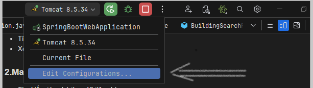
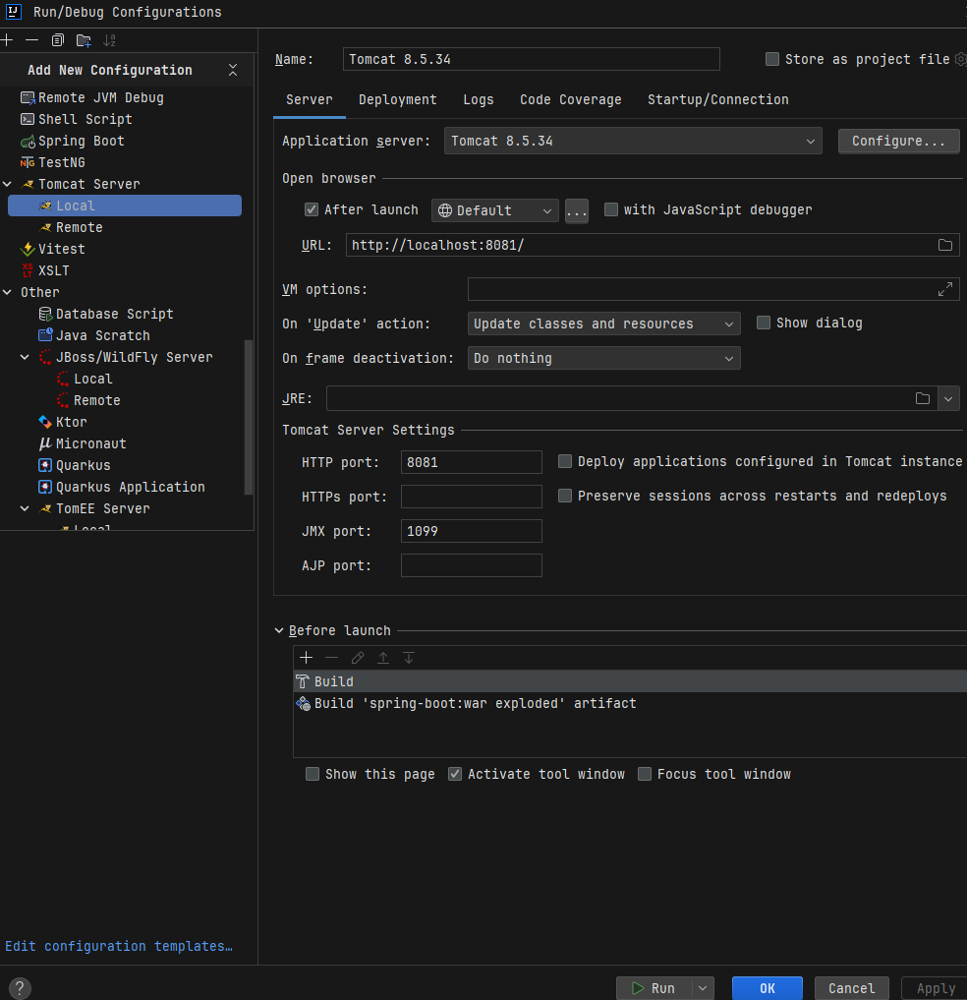

# SkyLand
SkyLand is a real estate management and rental website. It is built and developed using Java, with Spring Boot as the main framework.

VIDEO DEMO:

[](https://youtu.be/7SoDYjKPFxk)

Website DEMO: https://linhng148.id.vn/

Admin Account DEMO:
- Username: nguyenvana
- Password: 123456

## Features

### 1. User
- User authentication
- Search for buildings based on requirements
- View information on rented buildings

### 2. Manager
- Search for buildings based on 16 criteria
- Add, edit, delete, view building information
- Assign buildings to management staff
- Manage accounts

## Product Deployment Guide

### System Requirements
- [OpenJDK 1.8](https://www.oracle.com/java/technologies/javase/javase8-archive-downloads.html)
- [Tomcat 8.5](https://tomcat.apache.org/download-80.cgi)

### Installation and Running the Application

This guide uses Intellij IDEA Ultimate 2024.1 to launch the project.

1. Clone the repository:
   ```sh
   git clone https://github.com/lyng148/sun_apply.git
    ```
2. Import the SQL file using MySQL stored in the Database folder, and edit the DATABASE connection information in the 'application.properties' file:
   ```properties
   spring.datasource.url = database URL
   spring.datasource.username = account
   spring.datasource.password = password
   ```
3. In Project Structure, set:
- SDK: 1.8 (OpenJDK)
- Language level: 8 - Lambdas, type annotations, etc.

4. In Run/Debug Configuration, select Edit Configurations...


Setup as shown below:


5. Press RUN to launch the web, a browser window will open automatically, or access it at http://localhost:8081
